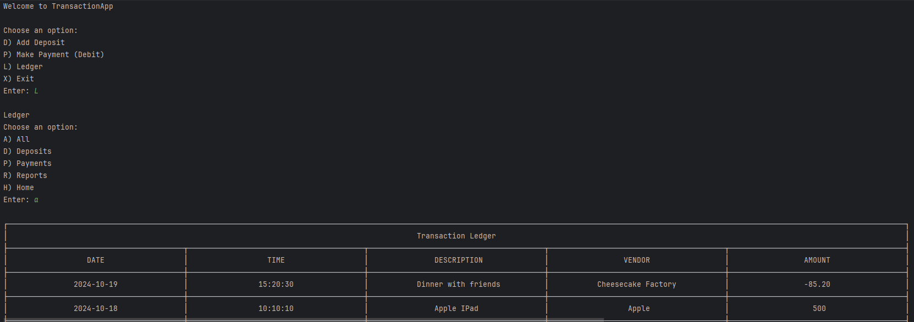
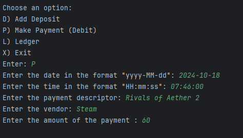
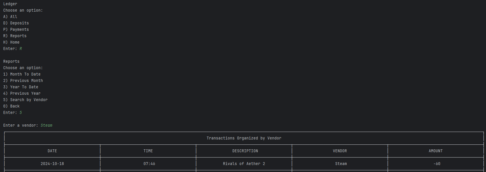

# Financial Tracker

## Description of the Project

The Financial Tracker project allows for a user to manually enter and view transactions from a .csv file. 
A **transaction** can be either a payment or deposit, and consists of:
- Date 
- Time 
- Description 
- Vendor 
- Amount

Transactions are stored within the program's ledger which can be printed out in various configurations. 
The ledger print configurations consist of:
- Month To Date
- Previous Month
- Year To Date
- Previous Year
- By Vendor

The ledger writes into the "transactions.csv" file, given the correct input of transaction data.

## User Stories
> - As a user, I need to see when a deposit or purchase has occurred in my finances, so that I can plan spending accordingly.
> - As a user, I need the ability to import and export my transaction information so that I can use it in other places than just the Financial Tracker program.
> - As a developer, I want to handle user input errors, so that the program won't shut down abruptly and cause user confusion and frustration.
> - As a developer I want to handle how transactions are managed in the main ArrayList and written to the csv file, so that the program runs efficiently.
> - As a user, I want to manually add transactions to the ledger, so that I can stay up to date on my purchases and deposits.
> - As a user, I want to be able to search my transactions and deposits by vendor, so that I know when I've done business with that vendor.
> - As a user, I want to be able to list transactions specified by dates, so that I can see my purchases and deposits during a certain window of time.
> - As a user, I want to have a Home Menu, Ledger Menu, and Reports Menu, so that I can access the relevant transaction information with little to no confusion.
> - As a user, I want to see my transaction information in a organized, visually appealing way, so that I can understand when transactions happened.

## Setup

Instructions on how to set up and run the project using IntelliJ IDEA.

### Prerequisites

- IntelliJ IDEA: Ensure you have IntelliJ IDEA installed, which you can download from [here](https://www.jetbrains.com/idea/download/).
- Java SDK: Make sure Java SDK is installed and configured in IntelliJ.

### Running the Application in IntelliJ

Follow these steps to get your application running within IntelliJ IDEA:

1. Open IntelliJ IDEA.
2. Select "Open" and navigate to the directory where you cloned or downloaded the project.
3. After the project opens, wait for IntelliJ to index the files and set up the project.
4. Find the main class with the `public static void main(String[] args)` method.
5. Right-click on the file and select 'Run 'YourMainClassName.main()'' to start the application.

### Using a pre-made .csv file

In order to use a pre-made .csv file with transactions, the file must be named "transactions.csv" placed in the main program folder,
and the information needs to follow the format:
> date|time|description|vendor|amount

 
## Technologies Used

- IntelliJ IDEA 2023.3.3 (Ultimate Edition)
- Java 17 (Amazon Corretto 17.0.12)

## Demo
### The Ledger Menu

### Making a Payment in the Home Menu

### Searching by Vendor using the Reports Menu

## Future Work

- Adapt table visual to allow for more characters per cell
- Custom Search
- Inline Comments and Documentation

## Resources

- [BigDecimal Documentation](https://docs.oracle.com/javase/8/docs/api/java/math/BigDecimal.html)
- [Year Documentation](https://docs.oracle.com/en/java/javase/21/docs/api/java.base/java/time/Year.html)
- [YearMonth Documentation](https://docs.oracle.com/en/java/javase/21/docs/api/java.base/java/time/YearMonth.html)
- [Center Text Function (Stack Overflow)](https://stackoverflow.com/questions/8154366/how-to-center-a-string-using-string-format)

## Thanks

Thank you to Raymond Maroun for continuous support and guidance.